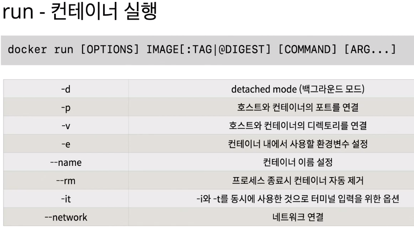
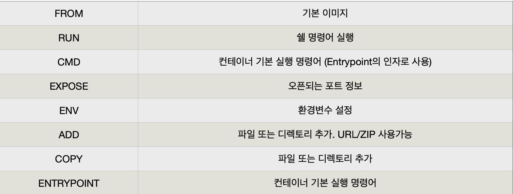
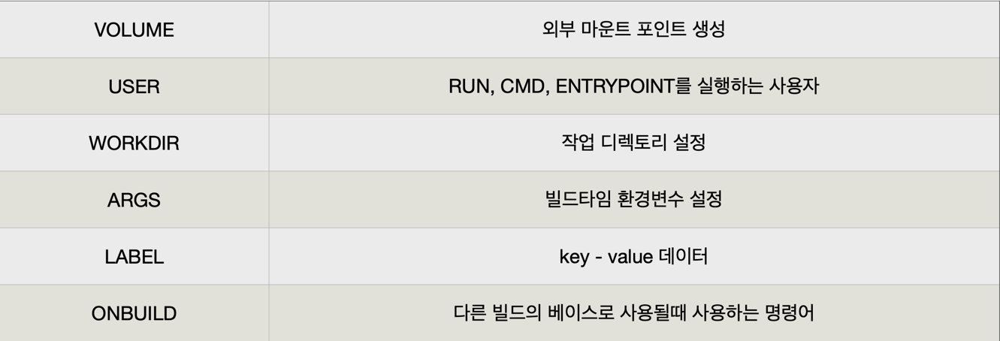

#Docker

docker version

pull - > 이미지 다운로드

docker images

docker rmi  : 삭제

https://www.youtube.com/watch?v=SJFO2w5Q2HI&list=PLuHgQVnccGMDeMJsGq2O-55Ymtx0IdKWf&index=5

docker run -p


docker exec ws3 pwd : 컨테이너 명령어 내리기

 

docker exec -it ws3 /bin/bash : 컨테이너에 지속적인 명령어를 내리고 싶을 때 (계속 붙는다.)
-> bash shell 이 없는 경우 docker exec -it ws3 /bin/sh

run -p 8888:80 -v /TIL/ANYTHING/Docker/htdocs:/usr/local/apache2/htdocs/ httpd
->경로 설정을 잘못했는가..

---
- docker 안내서
- 설치는 그냥 docker desktop 으로 설치
  - docker version 
    - docker version 확인
  - 주요 옵션
    - 
  - 우분투 설치 : docker run ubuntu:20.04
    - 아무런 옵션을 주지않아 바로 종료됨
  - 우분투 삭제 : docker rmi ubuntu:20.04
  - 우분투 쉘 실행: docker run --rm -it ubuntu:20.04 /bin/sh
  - CentOS 실행하기: docker run --rm -it centos:8 /bin/sh
  - 웹 어플리케이션 실행하기
    docker run --rm -p 5678:5678 hashicorp/http-echo -text="hello world"
  - # m1
  - docker run --rm -p 5678:8080 ghcr.io/subicura/http-echo --text="hello world"
    - http localhost:5678
```text
HTTP/1.1 200 OK
Content-Length: 11
Content-Type: text/plain; charset=utf-8
Date: Sun, 06 Nov 2022 00:47:41 GMT

hello world


```

- 레디스 시작
  - docker run --rm -p 1234:6379 redis
  - telnet localhost 1234
    - telnet 설치 : 
      - brew tap theeternalsw0rd/telnet
        brew install telnet
  - set hello world
    +OK
    get hello
    $5
    world quit
  - exec 명령어
  - exec 명령어는 run 명령어와 달리 실행중인 도커 컨테이너에 접속할 때 사용하며 컨테 이너 안에 ssh server등을 설치하지 않고 exec 명령어로 접속합니다.

- docker compose
  - docker-compose version
```yaml
version: '2'
services:
  db:
    image: mariadb:10.9
    volumes:
      - ./mysql:/var/lib/mysql
    restart: always
    environment:
      MYSQL_ROOT_PASSWORD: wordpress
      MYSQL_DATABASE: wordpress
      MYSQL_USER: wordpress
      MYSQL_PASSWORD: wordpress
  wordpress:
    image: wordpress:latest
    volumes:
      - ./wp:/var/www/html
    ports:
      - "8000:80"
    restart: always
    environment:
      WORDPRESS_DB_HOST: db:3306
      WORDPRESS_DB_PASSWORD: wordpress
```
- docker compose 를 이용하여 mysql과 wordpress를 실행합니다.
  - docker-compose up -d
- docker compose를 이용하여 mysql과 wordpress를 종료합니다.
  - docker-compose down
```text
version
version: '3'
docker-compose.yml 파일의 명세 버전
docker-compose.yml 버전에 따라 지원하는 도커 엔진 버전도 다름

services
services: postgres:
... django:
...
실행할 컨테이너 정의
docker run --name django과 같다고 생각할 수 있음

image
services: django:
image: django-sample
컨테이너에 사용할 이미지 이름과 태그 태그를 생략하면 latest
이미지가 없으면 자동으로 pull

ports
services: django:
... ports:
- "8000:8000"
컨테이너와 연결할 포트(들) {호스트 포트}:{컨테이너 포트}

environment
services: mysql:
... environment:
- MYSQL_ROOT_PASSWORD=somewordpress: '3'
- -
컨테이너에서 사용할 환경변수(들) {환경변수 이름}:{값}

volumes
services: django:
... volumes:
- ./app:/app
마운트하려는 디렉터리(들)
{호스트 디렉터리}:{컨테이너 디렉터리}

restart
services: django:
restart: always
재시작 정책
restart: "no"
restart: always
restart: on-failure restart: unless-stopped

build
django: build:
context: .
dockerfile: ./compose/django/Dockerfile-dev
이미지를 자체 빌드 후 사용
image 속성 대신 사용함
여기에 사용할 별도의 도커 파일이 필요함

```
- 우분투 images 에 + git 을 설치버전의 images 만들기
- docker images
```text
$ docker run -it --name git ubuntu:latest bash
root@2f8bfff679f9:/# git
bash: git: command not found
root@2f8bfff679f9:/# apt-get update
root@2f8bfff679f9:/# apt-get install -y git
root@2f8bfff679f9:/# git --version
git version 2.25.1
```
```text
commit
    ~  docker commit git ubuntu:git
run
    ~  docker run -it --name git2 ubuntu:git bash
    
도커 이미지 만들기
이름 공간 이미지 이름 태그 
    docker build -t subicura/ubuntu:git01 .
명령어                                 빌드 컨텍스트
```

- Dockerfile
- 
- 

```text
이미지 빌드
docker build -t {이미지명:이미지태그} {빌드 컨텍스트}
$ docker build -t sample:1 .
```