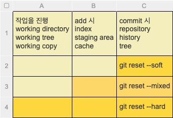

# git.bash 실습. 생활코딩 최고 ?:)

git init   - git 저장소 초기화  
ls -al - 현재 파일 목록  

- vim f1.txt  - 파일생성 (i - insert모드 , : wq 저장후 종료)  
- cat f1.txt - vim 모드가 아닌 상태로 소스보기  
- git status -
- git add f1.txt
- git config --global user.name jeong  
- git config --global user.email snowwwww12@gmail.com
- git commit - > vim으로 이동됨
- git log - 로그보기
- 소스 수정시 - > git add ... -> commit & message -> git log
- cp f1.txt f2.txt - 파일 복사


- git log -p - 커밋과 커밋사이의 소스상 차이점을 보는 명령어
- git log 0d3f71cc74d56ef1cfdb82e959d81417247b13a0 -> 해당 고유번호 이전 커밋내용만 본다.
- git diff f0350c2440c3c5bb1cf95f51c54c77614793157c..485793a571d8e6f6192fdeace14d46da4967108a 각각 고유번호 사이의 차이점을 나타내 준다.
- git diff - 어떠한 작업을 진행했는지 알 수 있다.


- reset VS revert
- git reset 0d3f71cc74d56ef1cfdb82e959d81417247b13a0 --hard => git log 에 고유번호 로 돌아간다.
- 공유를 하고나서는 절대로 reset 하지않는다.
- revert 또한 되돌리수 있지만 현재상태에서는 배우지 않는다.


- git 명령어 빈도 높은 순
- commit, push, pull, clone, checkout, add
- branch, log, diff, fetch, merge, init
- tag, rebase, rm, show, bisect, grep, mv

- git commit --help
- git commit -am "message"


- git의 원리 - with : gistory
- add, commit - objects 파일안에 내용이 저장된다. index에 파일에 파일명이 저장된다.(해시)
* add시 - 파일의 이름이 다르더라도 내용이 같다면 같은 주소값을 가진다.ex)파일 복사시, 또는 전세계적으로도.
  * objects 파일명 안에 담긴다. 
  * object 파일명의 원리(내용이 같으면 관리하는 파일 이름이 같다)
    * 아마 내용을 깃이 살펴보고 부가적인 설정을 더하여 sha1 해시값으로 변경하기 때문이다.
* commit - objects 파일에 담긴다.
  * parent가 생긴다 -> 이전 커밋을 가르킨다.
  * commit 안에 tree - 현재 해시값, parent 등 오브젝트값 등이 담겨있다.
  * object 파일안의 내용 3가지
    * 파일의 내용을 담고있는 블랍(blob)
    * 어떤 디렉토리의 파일명과 그 파일명의 내용에 대한 블랍을 담고있는 파일
    * 커밋파일
  * status - 추론 : index 파일안에 해시값을 비교하여, status 값을 나타낼 듯 하다.
  
* branch -  
* git branch
* git branch exp - > 새로운 branch만들기
* git checkout exp - > branch 변경
* 브랜치 변경후 commit 후 git log 살펴보면 브랜치 별로 로그가 다르다.
* 파일을 열고 브랜치를 변경하면 파일 구성도 새롭게 적용된다.
* branch 상태확인
  * git log --branches --decorate => HEAD 및 branch별 최신 커밋파일을 알려준다.
  * git log --branches --decorate --graph =>좌측에 빨간색 등의 줄이생긴다.
  * git log --branches --decorate --graph --oneline - 한줄로 현재 상태를 보여준다.
  * git log master..exp -> master 와 exp 차이점
  * git log exp..master -> exp에는 없고 master에는 있는것
  * git log -p exp..master -> 차이점 및 소스구문까지 필요할경우 -p 옵션
  * git diff master..exp   


* branch 병합 (merge)
  * exp -> master 로 옮기는 방법
    * exp -> master로 가져올려면 checkout을 master로 하고 git merge exp
    * git branch -d exp -> 브랜치 삭제    
* branch 수련
* https://git-scm.com/book/en/v2
* git checkout -b iss53 명렁어의 -b 옵션은
  * git branch iss53  + git checkout iss53 를 한 것이다.
* Fast-forward -> 
* Merge made by the 'recursive' strategy. ->
* -D 묻지않고 지우기 옵션


* stash (감추다, 숨겨두다)
  * branch 작업중 다른 branch 작업을 할 경우 기존 commit 되지 않은 파일 때문에, 문제가 생길 수 있어, 해당 작업내용을 숨겨둘 수 있다.
  * head 의 버전으로 이동하여 브랜치 상태를 깔끔하게 유지하고 commit 할 수 있다.
* git stash save 또는 git stash -> git status -> clean
* git stash apply -> 작업후 해당 branch stash 다시 불러오기
* git stash list -> stash list 보기
* git reset --hard 로 최신 커밋상태로 변경하면 git status 하면 clean 상태로 변경됨
  * 해당 reset을 하였어도 stash list는 남아있음 git stash apply 로 다시 불러올 수 있음
* reset -> 파일추가 -> add후 stash로 숨김처리 후 apply명령어 실행하면 가장 상단의 상태로 가져온다.
  * 개별로 적용된 파일을 불러오고 싶을경우에는 git stash drop 로 가장 상단을 삭제 후 적용해야 한다.
* git stash apply; git stash drop; 명령어로 불러오고 삭제처리 할 수 있다.
  * git stash pop  -> 위 apply + drop 을 합쳐놓은 명령어
* git stash 는 최소한 추적되고있어야 ㅎ나다(버전이 관리되고 있는)
  * 예를 들어 파일을 생성하고 add하지 않은 상태는 stash 명령어에 포함되지 않는다.


* reset시 다시 돌리고 싶을경우 -> git reset --hard ORIG_HEAD
* git reflog -> 모든 로그를 살펴볼 수 있다.

* git reset 옵션  


* merge & conflict 
  * 충돌이 일어나면 index 폴더에 고유번호 뒤에 번호가 붙는다.
    * 3 way merge
    * kdiff3 설치
      * git config --global merge.tool kdiff3
      * git mergetool
      * 툴을 이용해 merge 가 완료된 후 git status 확인하면, orig 라는 파일이 샹성되어 있는데, 만약을 대비한 백업으로 삭제해도 무방하다.
        * rm f1.txt.orig
    * 3 way merge?
      * 수정된 목록을 기준으로 병합한다.
      * ex) 나는 파일삭제, Base는 파일 유, 상대방은 파일 유
        * -> Base기준으로 파일 삭제가 수정 된 것이므로 삭제 병합 진행

* 소스 저장소 remote repository
  * 소스파일을 백업한다
  * 다른 사람과 협업한다.
* 저장소 생성
  * git init --bare
    * .git 파일에 들어가는 working directory 가 없는..
    * --bare  : 수정이 불가능한 저장소 
    * git remote add


* github
  * Fork - 나의 소스로 복제된다(수정이 자유롭다)
  * git clone gitAddress
  * git log --reverse -> 로그 역순
  * git checkout 커밋아이디 -> git log 시 해당 아이디만 확인 됨.
  
  * 기존 작업을 git에 연결하기
    * git remote add origin gitAddress
      * origin -> 별명(대부분 origin 씀)
      * 삭제 하고 싶을 경우 git remote --help -> git remote remove 별칭
      * git push -u origin master (최초 1회만 입력)
      * git commit --amend -> 커밋 메시지 변경(push전에만 사용하자)
      * git pull - 최신소스 당겨오기
      * git log --decorate --all -> 모든 branch에 대한 fetch 필요 파일을 받고 끝난다 -> merge를 수행
      * pull -> 파일을 다운받고 병합까지 진행한다.

* tag
  * releases -> 오픈된 버전
  * tag 를 가르키즌 commit 버전은 항상 고정되어 있다.
  * git tag 1.0.0 master(브랜치 이름을 적어도 되고, log 고유값을 적어도 됨)
  * annotated tag
    * git tag -a 1.1.0 -m "bugs fix" - 자세한 tag 설명을 적을시
  * 태그 push
    * git push --tags
  * semeantic versioning
    * git tag -d 1.1.0


# 깃 리모트 변경 하기
* 기존 리포지토리 깔끔하게 pull / push
```
git pull
git add .
git commit -m "clean push"
git push
```

* 기존 리포지토리 remote 제거
```
git remote remove origin
```
* 새 리포지토리 remote 추가
```
git remote add origin https://github.com/계정/리포지토리
```


