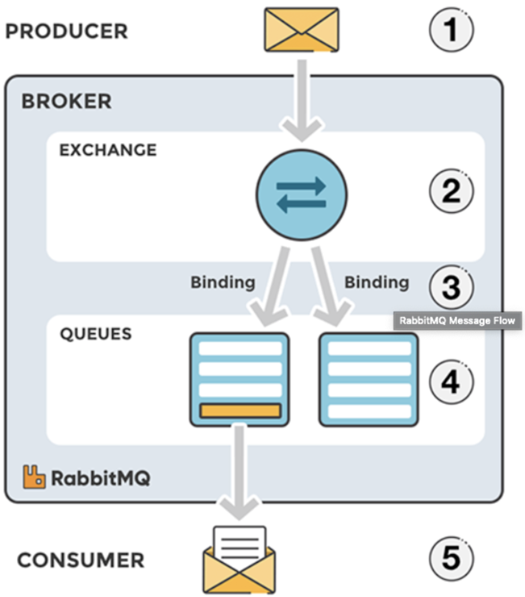

# RabbitMQ

업무에 의해 배워야 할 필요성을 느껴 살펴보었다.

* 레빗엠큐 란 ?
  * 메세징 큐 시스템.
  * 얼랭(Erlang) 으로 AMQP 를 구현한 메시지 브로커 시스템
    * *얼랭 - 범용 병렬 프로그래밍 언어
    * *AMQP - Advanced Message Queuing protocal : 메시지 지향 미들웨어를 위한 개방형 표준 응용 계층 프로토콜
    *아케텍쳐  - 
    * producer : 메세지를 보내는 아이
    * exchange : 메세지를 목적지(큐)에 맞게 전달하는 아이
    * queue : 메세지를 쌓는 아이
    * consumer : 메세지를 받는 아이
    * producer(sender)가 메세지를 보내면, exchange 에서 해당하는 키에 맞게 큐에 분배(바인딩, 라우팅) 하고  해당 큐에서 consumer(receiver)가 메세지를 받음

* exchange 모드
  * direct : bindKey = exchange 같은 큐에 전달
  * topic : bindKey, exchange 일부 패턴이 같은 큐에 전달
  * fanout : 전체 전달
* Virtual host 란
  * 가상 호스트로 사용자마다 가상 호스트에 권한을 부여하여, 권한이 있는 사용자만 접근하도록 할 수 있다.
    
