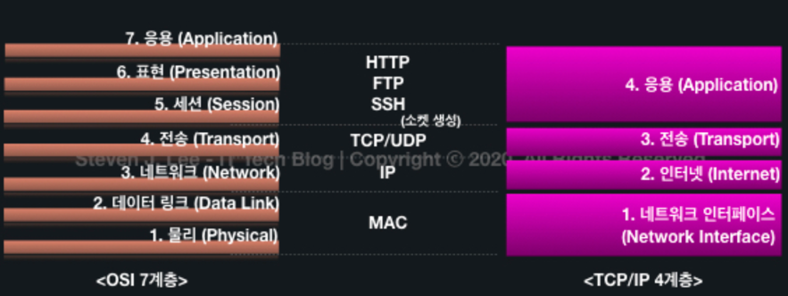
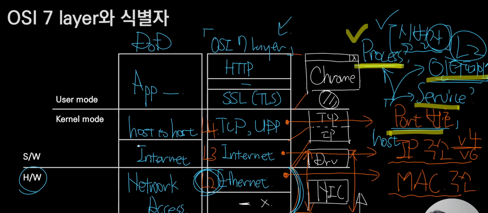

#Internet 기반 네트워크 입문
- OSI 7 Layer 와 식별자

- 식별자
  - mac address 
    - NIC - 랜카드 를 식별한다.
  - IP 주소
    - Host
  - Port 번호
    - Process (endPoint)
    - Service(l3, L4)
    - 인터페이스(L2)
    
---
- Host 는 이렇게 외우자!
  - host = Network + Computer
    - 인터넷이 연결된 컴퓨터구나 생각하자
    - End-point
      - 이용주체, 단말기
      - 클라이언트, 서버, peer(p2p)
    - Switch
      - Network 그 자체를 이루는 host(infra)
      - Router, IPS(시큐리티 스위치), Tab

---
- 스위치가 하는 일과 비용
  - 패킷, 라우터(스위치), 라우팅 테이블(이정표)
  - Metric: 네트워크 비용

---
- L2 스위치에 대해서
  - lan 케이블 연결됐다 -> Link-Up
  - lan 케이블 연결이실패 -> Link-Down
  - Up-Link
    - L2 -> Router 에 연결된 선(L3 로 나아가는 연결 선)
  - L2 Distribution Switch
    - L2 Access 스위치를 위한 스위치
    - VLAN(Virtual LAN) 기능을 제공하는 것이 일반적.
  - 느낌
    - 방하나 - L2
    - 방하나 + 방하나 = 층 - L2 Distribution Switch
    - 층+ 층.. = 건물 - Router
  - 

---

