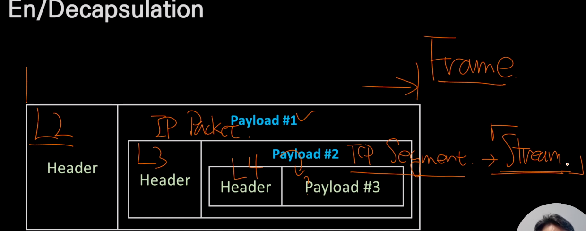
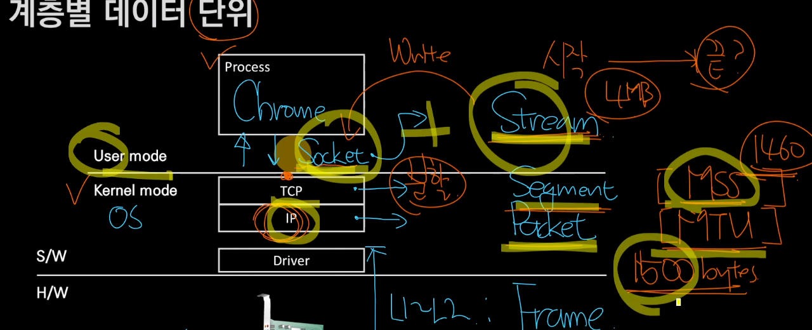
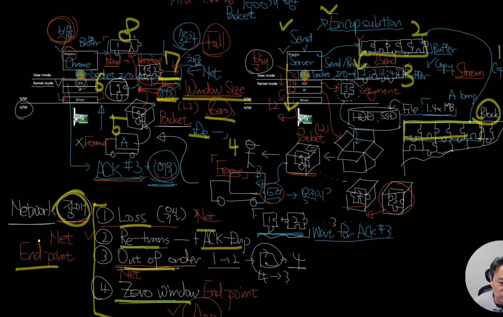
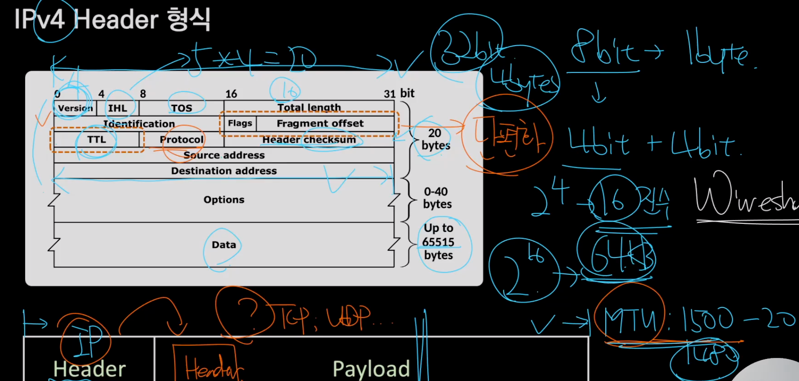

#4장 - L3 수준에서 외울 것들
---
- ipv4 주소의 기본구조
  - 32bit 주소체계
  - 8bit.8bit.8bit.8bit 로 구성되어있다.
  - 앞에 24bit -> Network ID
    - 택배로 치면 큰 섹터(동 이든, 구 이든) 를 구분하는
  - 뒷 8bit -> Host ID
    - 택배로 치면 번지 정도.

---
- L3 Ip Packet 으로 외워라
  - Packet 이라는 말은 L3 IP Packet 으로 외우자.
  - Header 와 Payload 로 나뉘며 이는 상대적인 분류이다.
  - 최대 크기는 MTU
    - 특별한 이유가 없다면 1500 bytes (1.4kb)
  - header
    - Src(출발지) -> Dst(목적지)

---
- Encapsulation 과 Decapsulation
  - Encapsulation
    - 단위화 했다.(포장)
  - Decapsulation

---
- 패킷의 생성과 전달
  - Process -> segment -> packet -> frame -> L2 Access Switch -> Router -> internet

---
- Socket
  - 엔드포인트, 
  - 파일을 추상화한, 커널모드 프로토콜을 추상화한 유저모드 어플리케이션이 접근할 수 있도록 추상화한 인터페이스이다.
  - 응용프로그램에서 tcp/ip를 이용하는 입구 역할을 하며, 응용프로그램과 소켓 사이의 인터페이스 역할을 하고있다.
- 계층형 데이터 단위
  - 

  - Segment - Segmentation
  - 가래 떡집 생각하면 될듯.

---
- TCP/IP 송수신 구조

---
- IP 헤더 형식
  - 

  