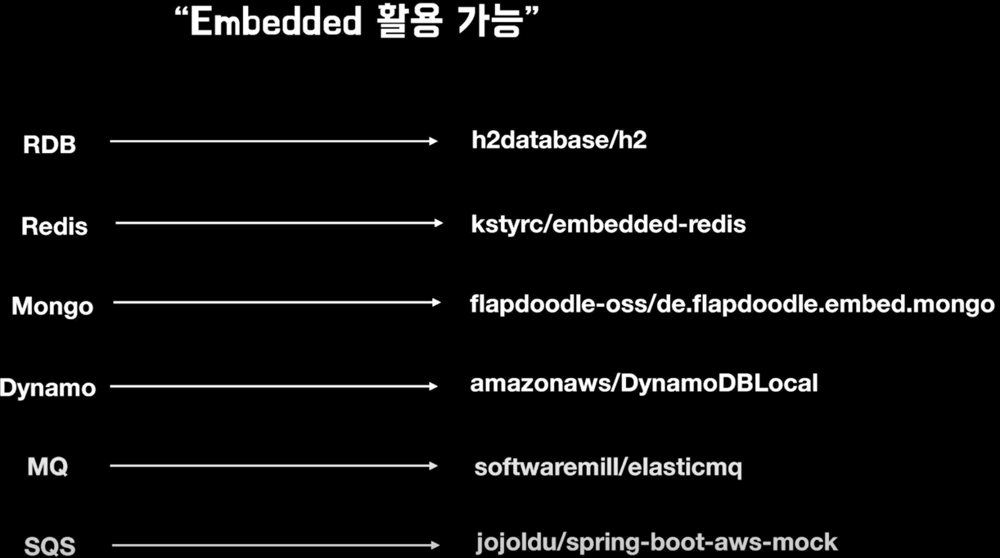

#TDD 에 대한 생각 요점 정리.
- tdd 도입에 앞서 서치와, 세미나 등을 보면서..

- 무엇을 기대하는가?
  - 리턱터링을 통한 낮은 결합, 높은 응집을 기대..
  - 욕심내면 지치니깐 스터디를 한다고 생각하고 천천히 진행을 했으면 한다.
  - 개인적인 생각으로는 어려워서 스트레스를 받는다면, 과감하게 넘어가고 추후에 다시 살펴봤으면 한다.
- 어떤걸 테스트?
  - 테스트 하기 쉬운코드부터 테스트를 해야할듯하다.
    - 같은 입력값에 항상 같은 결과를 반환하는 코드
    - 외부상태를 변경하지 않는 코드.
    - 테스트하기 쉬운 코드로 리팩터링하면서 테스트를 만들어야할듯.
  - 어떻게 테스트?
    - 테스트가 가능한 영역부터(외부 API 들은 우선 제외 또는 고민..)
    - 최대한 프레임워크에 종속적이지 않게.
    - Mock 사용도 최대한 자제.
    - Embedded (정해진 특정한 기능을 수행, 특정한 수행을 지원하기 위한 소프트웨어)
    - 최대한 가볍게
---

- Embedded 활용 가능
  - 

  
---

- 테스트작성 - 개발 - 리팩토링 반복 사이클(Red - Green - Refactor)
  - 테스트작성(최소한 실패코드) -> 최소한의 성공 구현코드 -> 리팩토링 -> 구현코드 -> 리팩토링....사이클
- 대원칙:
  - 쉬운 케이스에서 -> 어려운 케이스 순서로 테스트팩
  - 예외적인 케이스 -> 정상 케이스 순서로 테스트
    - 초반에 예외 상황을 테스트하면 예외 구조가 미리 만들어 지기 때문에, 코드 구조가 덜 봐뀜.
    - 예외적인 상황을 미리 고민하고 찾아보는 과정을 통해 버그 발생의 가능성을 미리 파악 가능.
- 장점
  - 안정감, 자신감 -> 빠른 리팩터링
  - 유지보수의 비용 절감.
  - 생각을 먼저하고, 코드를 작성하기 때문에 논리적 사고 올라감.
- 리팩토링 시점
  - 작은 리팩토링은 즉시 실행
  - 메서드 추출같은 코드 구조에 영향을 주는 리팩토링은 큰 틀에서 구현 흐름이 눈에 들어오기 시작한 후 진행.
  - 큰 단위의 리팩토링은 전체 코드의 의미나 구조가 명확해졌을 때 시도한다.
    - 리팩토링 범위가 크면 리팩토링에 실패할 수도 있다.
    - 범위가 큰 리팩토링을 진행하기 전에는 코드를 커밋한 후, 별도 브랜치에서 작업한다.
- 리팩토링 팁
  - 중복이 있다고 무조건 제거보다는 코드의 가독성 과 수정이 용이한 경우에 중복을 제거하자.
  - 메서드 파라미터 개수는 적을 수록 코드의 가독성과 유지보수에 유리하다
    - 파라미터 개수가 3개 이상이면 객체로 봐꾸는 것을 고려하자.
- 걱정되는것
  - 테스트를 통과할 만큼의 코드만 작성하자.
  - 필요할 것으로 예측해서 미리 설계를 유연하게 만들지 않는다.
  - 테스트 케이스를 추가하고 통과시키는 과정에서 필요한 만큼만 설계를 변경한다.
  - 예외 또한 미리 앞서서 정의하지 않고, 테스트를 진행하는 과정에서 실제 예외가 필요해지는 시점에 예외를 도출하고 추가한다.

- 책을 구매함.정독해서 얼른 읽어야겠다.

---
테스트 보기 쉬운 코드로 리팩터링.

- 하나의 서비스(ex:회원가입)
  - 비즈니스 요구사항을 나열한다.
  - 비즈니스 적 설계 사항을 위주로 테스트 하자.
  - 테스트 불가능한 영역을 Boundary Layer 로 올려서 테스트 가능하도록 변경.
    - 콜 트리를 살펴볼떄 가장 아래부분이 테스트가 불가능하다면 최대한 위로 끌어올려 테스트 보자.
---

#레거시코드에 테스트 추가를 위한 3가지 기법

- characterization Test
  - 수동으로 테스트를 추가하는 기법(from Working Effectively with Legacy Code)
- Approval Test
  - characterization Test 를 다양한 인자의 조합으로 작성을 돕는 라이브러리
- Mutation Testing
  - 100% 의 테스트 커버리지를 갖는 코드도 완전한 버그가 없는 것을 보장하지 못함
  - 프로덕션 코드의 일부를 수정하여 테스트가 실패하는지 확인하며, 프로덕션 코드가 변경되었을때 테스트가 실패하도록 테스트를 추가해 나가는 기법
  - PIT 를 이용하면 프로덕션 코드의 변형을 자동으로 생성 가능

---
- 적용해볼까?
- Spring REST Docs
- Spring Cloud Contract
  - [Producer] Generate Contract Test
  - 힘든 작업이다..팀 단위로 많은 협업이 필요하다.
- AfterEach - 사용한 리소스는 모두 닫거나 clear 해준다.
- 단계가 필요하다면 - JUnit5 => DynamicTest 를 추천한다.

#리팩토링
- 메소드
  - 메소드가 한가지 일만 하도록 구현
  - 들여쓰기 2 depth 부분을 리팩토링 하자
  - else 예약어를 쓰지 않도록 구성해보자
  - local 변수가 꼭 필요한지 고민해보자.
  - compose factory 를 연습하자
  - 극단적으로 연습해보자.
    - ex)15라인을 넘지 않겠다.
    - ex)8줄로 변경해 보겠다 -> 설꼐를 재구성 하더라도..(연습을 통해 얻는게 있다.)
- 클래스 변수를 3개 이상 두지 말자(연습)
- 마음가짐
  - 조급함 대신 마음의 여유
  - 나만의 장난감 프로텍트로 시작
  - 같은 과제를 반복적으로 구현할 수 있는 인내력

- sw 엔지니어: 설계를 잘하는 사람 -> 코드를 잘 작성하는 사람 -> 클린코드
- sw 공학의 특징
  - 유지보수 비용(80% 이상)
  - 한번 작성한 코드는 10번 이상 읽음, 작성보다 이해에 10배의 노력 소모
  - 90% 이상의 시간을 어떤 코드를 이해하는데 사용함
- 로버트 C 마틴: 빨리가는 유일한 방법은 잘 가는 것이다.

- 코드 리뷰
  - 공유 활동
  - 배움을 주고 받는 행위를 통해 성장
- 주목적: 품질문제 검수(버그, 장애)
- 더 나은 코드 품질: 아키텍처 속성 개선을 위한 코드 개선 -> 향후 개선 비용 개선
- 동기부여 증가, 개발문화 개선, 설계 개선 제안
- 괴로우면 더 자주해라