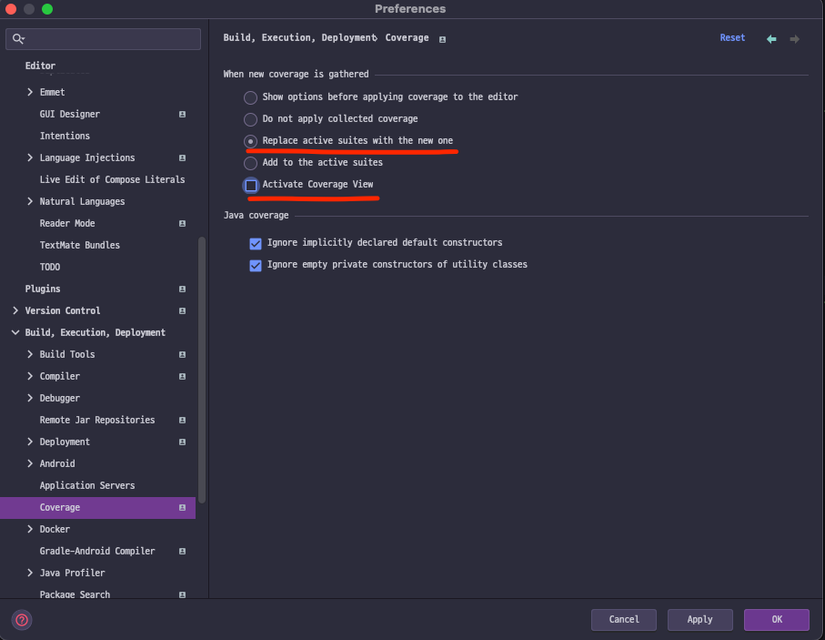
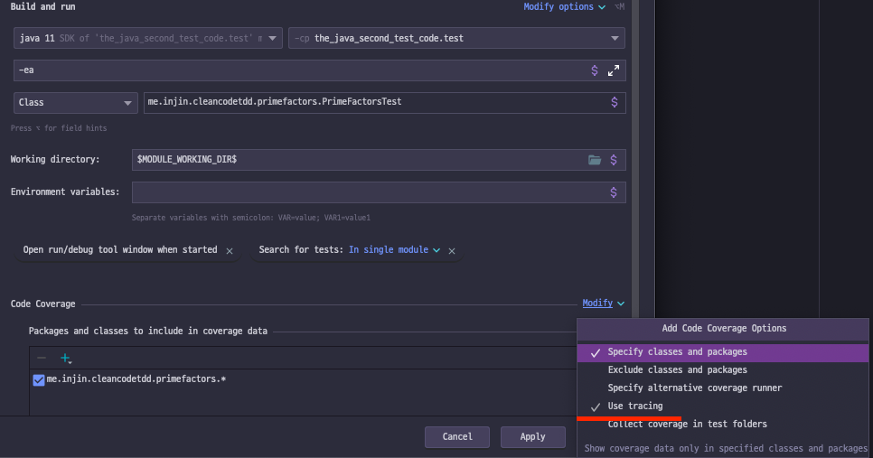

#꿀 팁

- if 뒤집기
  - invert 'if' condition
- 매서드 클래스로 올리기
  - Method Object
- 클래스를 서브클래스로 내리고 싶을때
  - Push Members down..

---
설정:  

- Activate Coverage View 를 선택 해제하지 않으면 실행될 때마다 커버리지 윈도우가 떠서 불편
- Replace active suites with the new one 을 선택하면 매번 새로운 테스트 결과가 보임

- code coverage options 에서 Use tracing 을 선택(default 는 sampling)
- sampling 일 경우 수행된 라인(초록), 수행되지 않은 라인(붉은)만 보임
- Use tracing 을 선택하면 조건에 의해서 수행되거나 되지않은 라인(노랑)이 보임
---
1. Fake it till you make it
   1. fake it은 null, 0, 1, true, false, empty list 등을 반환하는 방법으로 테스트를 성공시키는 기법이다.
2. Stairstep Tests
   1. 테스트의 유일한 존재 목적이 다음 테스트를 순차적으로 구현하기 위함인 경우(다음 테스트를 구현한 후에는 stairstep test는 삭제된다).
3. Assert First
   1. 테스트 작성시 assert부터 즉 거꾸로 작성하는 것이다.
4. Triangulation
   1. 토목/수학에서 말하는 삼각법(물체간의 거리를 측정하는)이 아니라 TDD에서 삼각법은 generalization을 만드는 방법의 하나를 의미한다.
   2. 하나의 테스트가 아니라 여러개의 테스트를 추가함으로써 문제와 해결책을 좀 더 명확히 하는 기법이다. 삼각법이 2개 이상의 지점의 위치를 이용하여 현 위치를 측정하는 것 처럼...
   3. "As the tests get more specific, the code gets more GENERIC"
5. One To Many
   1. one to many practice는 리스트에 있는 많은 아이템을 다뤄야 하는 것을 알고 있더라도 하나의 아이템을 가지고 시작하는 것이 최상이라는 것이다.
6. Refactoring Tests
   1. production 코드만 리팩토링하고 test 코드는 리팩토링하지 않으면 재앙에 빠진다.

---

- 뒤로갈수록 안좋다..

1. Null
    - 널을 반환하여 해결
2. Null to Constant
    - 널을 상수로 변경
3. Constant to Variable
    - 상수를 변수로 변경
4. Add Computation
    - 조건문을 넣거나 문장을 넣거나
5. Split Flow
    - 분기문을 구체적으로 그 조건만 넣고 점점 일반화 한다
6. Variable to Array
    - one-to-mant 애 댜초허눈 가법: stack 예시 push, push, pop, pop -> 배열로 변경해서 처리한다.
7. Array to Container
    - 어레이를 리스트로 변경하면 좀 더 쉽게 코드, 테스트가 가능하다.
8. If to While
    - if, if  중첩될경우 while 로 처리해 보자.
9. Recurse
    - 재구호출을 사용해보자. (문제를 분할해서 해결할 수 있다면 재귀가 나쁘지만은 않다.성능이슈도 같이 고려하자)
10. Iterate
    - 반복되는 계산로직이 있는데, 어떠한 이유로 재귀를 사용하지 않기를 원할때 for loop 식으로 변경하자
11. Assign
    - 이미 존재하는 변수의 값을 변경하는..
12. Add Case
    - 이미 분기된 흐름이 있는데 더 분리하고자 할때 else if, else if, ... 추가하는 것

