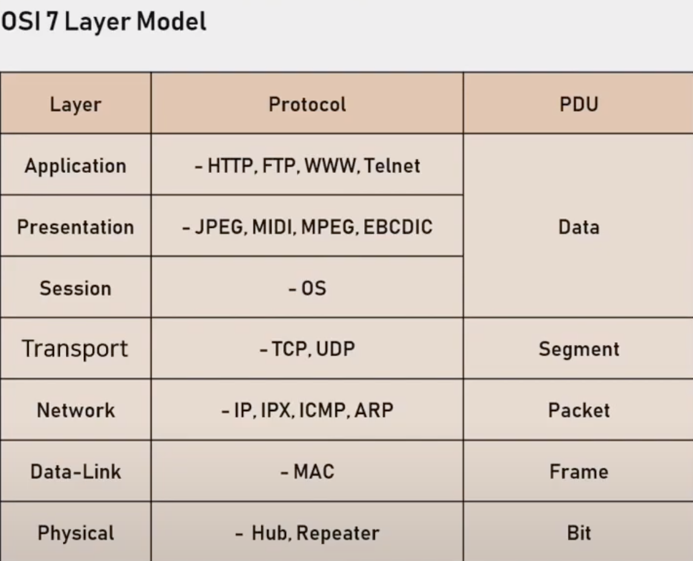

# OSI_7_Layers
> OSI 7 계층

Layer 1: 물리(Physical) 계층

Layer 2: 데이터 링크(Data-Link) 계층

Layer 3: 네트워크(Network 계층

Layer 4: 전송(Transport) 계층

Layer 5: 세션(Session) 계층

Layer 6: 표현(Presentation) 계층

Layer 7: 응용(Application) 계층

