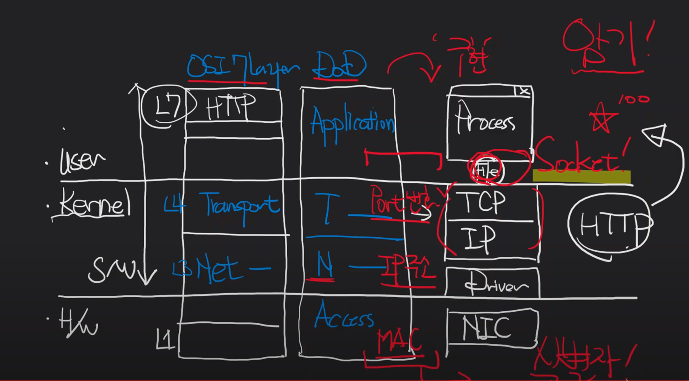

#Network

* TCP/IP Socket 이란
  * user mode applitaion process 가 접근할 수 있도록 file 형태로 interface 한 것이 Socket 이다.
  * 

* Host
  * Network 에 연결된 computer
    * 호스트를 나누는 2가
      * 네트워크 자체를 이루는 컴퓨터 혹은 호스트
        * Switch 라 한다.
      * 네트워크를 이용주체
        * End-Point(Server, Client, Peer)
* 네트워크(인터넷) 를 이루는 중요 2가지
  * Router + DNS

* 식별자 - 무엇데 대한 식별자인가
  * MAC 은 NIC(Network Interface Card)(LAN 카드) 의 식별자
    * NIC 1개당 n 개의 ip 주소를 바인딩 할 수 있다.
  * IP 주소(v4, v6) - Host 에 대한 식별자(인터넷에 연결된 컴퓨터)
  * Port 번호()
    * s/w 개발자 - port 번호는 - process 식별자?
    * network 관리자 - (user mode application 이 아닌 4계층) - service?
    
* IP 주소와 Net-mask
  * IPv4 - 주소길이: 32bit 2의32제곱 (대략 43억개)
  * IPv6 - 주소길이: 128bit 2의 128제곱(대략 )
  * IP주소 = Net ID + Host ID
    * Net ID 의 길이를 알려주는게 서브넷 마스크(넷 마스크)이다.

* Port 번호 - 식별자
  * Process 식별자
  * Service 식별자
  * Interface 식별자
  
* Switch, Switching
  * 인터넷 - Router 의 집합체
  * 네트워크 출발지 ~ 도착지점까지 n개의 라우터끼리 통신하여 최적화된 경로로 지나가게되는데 해당 교차점을 라우터라 하며, 라우터에 도착하면 최적화된 경로로 스위칭을 한다.  
      최적화된 경로의 근거는 "라우팅 테이블" 이라 한다.
  * Router - L3 Switching 

